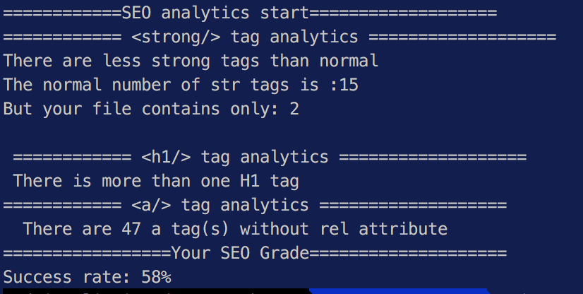

# Description

This is a basic seo analyser based on the rules below:
-  Detect if any  tag without alt attribute
- Detect if any <a /> tag without rel attribute
-  In <head> tag

i. Detect if header doesn’t have `<title>` tag

ii. Detect if header doesn’t have `<meta name=“descriptions” ... /> `tag

iii. Detect if header doesn’t have `<meta name=“keywords” ... />` tag

-  Detect if there’re more than 15 `<strong> `tag in HTML (15 is a value should be configurable by user)

-  Detect if a HTML have more than one <H1> tag.

# Installation

- `npm i seoreadder`

# Base Usage 

`var seoreadder=required('seoreadder')
var strongTagNumber=15
seoreadder('path/to/index.html',strongTagNumber)`

# Output

# Contribution

Fork and enjoy coding :) 

